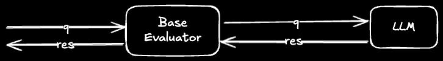

## Knowledge Evaluations for building AI Agents

The objective of this project is to evaluate the effectiveness of various knowledge architectures for LLM-powered AI agents. In other words, the goal is to measure the effectiveness of knowledge storage and retrieval strategies to aid the LLM vs focusing on the capabilities of the LLM itself.

To perform the series of knowledge evaluations we will be questioning the LLMs on a set of multiple choice questions testing the knowledge of AP history. Since this knowledge is very foundational for functioning of LLMs, larger models with more parametric memory have internalized it already; even without any additional context models like `Gemini 2.0/2.5 Flash` are able to score `> 95%` on this question set. 

So, for the purposes of evaluating the effectiveness of knowledge architecture and retrieval quality, we will be using LLM models which are smaller than `< 8B` parameters to increase the likelihood that the LLM must rely on the provided context to answer the given questions.

## Overview of results

| Model       | Baseline Score | Vector RAG |Vector RAG (with re-ranking) |
|----------   |----------      |----------  |----------|
|granite3.3:2b|(48.34%)|(51.66%) |(47.87%)|
|qwen3:1.7b   |(59.24%)|(58.77%) |(62.09%)|
|qwen3:4b     |(72.04%)|(72.99%) |(76.78%)|
|gemma3:1b |(31.28%)|(27.01%) |(25.59%)|
|gemma3:4b |(60.66%)|(58.29%) |(59.72%)|
|phi4-mini:3.8b |(68.25%)|(63.03%) |(69.67%)|

Findings so far:
- Introduction of `unranked` chunks within the context, leads to a drop in scores, potentially creating confusion for the LLMs when finding relevant information within the added context.
- Introduction of `ranked` chunks within the context, improves the scores marginally, larger gains are observed for models >= 4B, potentially because they are able to reason well with the added context. 

## Result Details

### Basic

The model is prompted with the question and expected to return the answer without specifying any context. In this approach the model is forced to rely upon its parametric knowledge.

- Model Input: Question
- Expected Output: Answer



| Model | Correct Answers | Pass % |
|----------|----------|----------|
|granite3.3:2b | 102/211 |(48.34%)|
|qwen3:1.7b | 125/211 |(59.24%)|
|qwen3:4b | 152/211 |(72.04%)|
|gemma3:1b | 66/211 |(31.28%)|
|phi4-mini:3.8b | 144/211 |(68.25%)|
|gemma3:4b | 128/211 |(60.66%)|

### Vector RAG: Baseline

- Chunking Strategy: [Title Based](https://docs.unstructured.io/open-source/core-functionality/chunking#%E2%80%9Dby-title%E2%80%9D-chunking-strategy)
- Context Retrieval Strategy: Top 3 results retrieved from vector search
- Model Input: Question + Context
- Expected Output: Answer
  


| Model | Correct Answers | Pass % |
|----------|----------|----------|
|granite3.3:2b | 109/211 | (51.66%)|
|qwen3:1.7b | 124/211 | (58.77%)|
|qwen3:4b | 154/211 | (72.99%)|
|gemma3:1b | 57/211 | (27.01%)|
|phi4-mini:3.8b | 133/211 | (63.03%)|
|gemma3:4b | 123/211 | (58.29%)|

### Vector RAG: With Re-Ranking of results

- Chunking Strategy: [Title Based](https://docs.unstructured.io/open-source/core-functionality/chunking#%E2%80%9Dby-title%E2%80%9D-chunking-strategy)
- Context Retrieval Strategy: Top 3 results after reranking the results using a cross-encoder.
- Model Input: Question + Context
- Expected Output: Answer


| Model | Correct Answers | Pass % |
|----------|----------|----------|
|granite3.3:2b| 101/211 | (47.87%)|
|qwen3:1.7b| 131/211 | (62.09%)|
|qwen3:4b| 162/211 | (76.78%)|
|gemma3:1b| 54/211 | (25.59%)|
|phi4-mini:3.8b| 147/211 | (69.67%)|
|gemma3:4b| 126/211 | (59.72%)|

### Vector RAG: With Re-Ranking of results on basic chunking with overlaps

- Chunking Strategy: [Basic with overlaps](https://docs.unstructured.io/open-source/core-functionality/chunking#%E2%80%9Cbasic%E2%80%9D-chunking-strategy)
- Context Retrieval Strategy: Top 3 results after reranking the results using a cross-encoder.
- Model Input: Question + Context
- Expected Output: Answer

| Model | Correct Answers | Pass % |
|----------|----------|----------|
|granite3.3:2b | 98/211 | (46.45%) |
|qwen3:1.7b | 120/211 | (56.87%) |
|qwen3:4b | 161/211 | (76.30%) |
|gemma3:1b | 45/211 | (21.33%) |
|phi4-mini:3.8b | 142/211 | (67.30%) |
|gemma3:4b | 136/211 | (64.45%) |


## Future evaluations
- [] Measure the impact of context rephrasing w.r.t to the input query
- [] Measure the impact of hybrid search (combination of TF-IDF and semantic search)
- [] Measure the impact of using smaller chunks in embeddings (< 500 chars) to increasing semantic uniqueness


## Runnign the evaluations

Execute: `uv run evaluator` to start the evaluation process. 

*Note: If the answers for the questions were already captured then the evaluator will skip it.*
```
Running knowledge evaluations...
Running BasicEval
granite3.3:2b: Starting evaluation
granite3.3:2b: Loaded the already existing output
granite3.3:2b: Generating answers ━━━━━━━━━━━━━━━━━━━━━━━━━━━━━━━━━━━━━━━━ 100% 0:00:00
granite3.3:2b: Eval completed
phi4-mini:3.8b: Starting evaluation
phi4-mini:3.8b: Loaded the already existing output
phi4-mini:3.8b: Generating answers ━━━━━━━━━━━━━━━━━━━━━━━━━━━━━━━━━━━━━━━━ 100% 0:00:00
phi4-mini:3.8b: Eval completed
qwen3:4b: Starting evaluation
qwen3:4b: Loaded the already existing output
qwen3:4b: Generating answers ━━━━━━━━━━━━━━━━━━━━━━━━━━━━━━━━━━━━━━━━ 100% 0:00:00
qwen3:4b: Eval completed
gemma3:1b: Starting evaluation
gemma3:1b: Loaded the already existing output
gemma3:1b: Generating answers ━━━━━━━━━━━━━━━━━━━━━━━━━━━━━━━━━━━━━━━━ 100% 0:00:00
gemma3:1b: Eval completed
gemma3:4b: Starting evaluation
gemma3:4b: Loaded the already existing output
gemma3:4b: Generating answers ━━━━━━━━━━━━━━━━━━━━━━━━━━━━━━━━━━━━━━━━ 100% 0:00:00
gemma3:4b: Eval completed
qwen3:1.7b: Starting evaluation
qwen3:1.7b: Loaded the already existing output
qwen3:1.7b: Generating answers ━━━━━━━━━━━━━━━━━━━━━━━━━━━━━━━━━━━━━━━━ 100% 0:00:00
qwen3:1.7b: Eval completed
granite3.3:2b: 102/211 correct (48.34%)
gemma3n:e4b: 151/211 correct (71.56%)
qwen3:1.7b: 125/211 correct (59.24%)
qwen3:4b: 152/211 correct (72.04%)
gemma3:1b: 66/211 correct (31.28%)
phi4-mini:3.8b: 145/211 correct (68.72%)
gemma3:4b: 128/211 correct (60.66%)
.
.
.
```